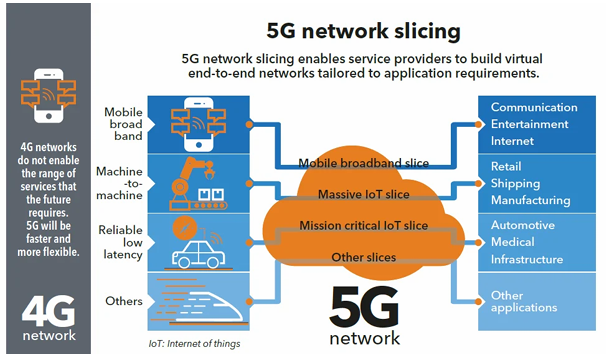
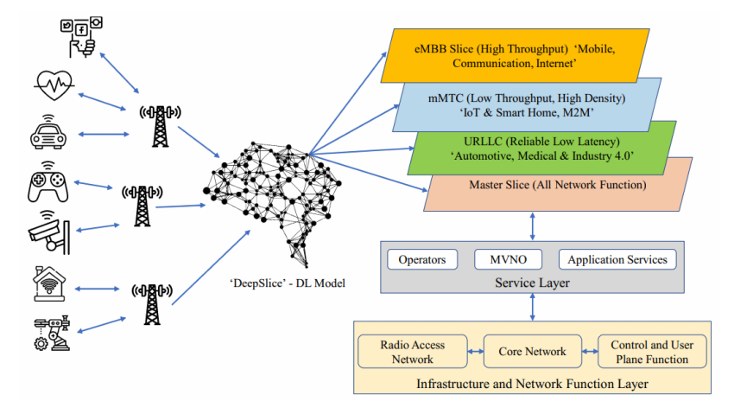
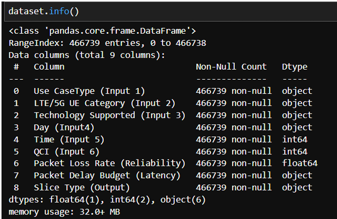
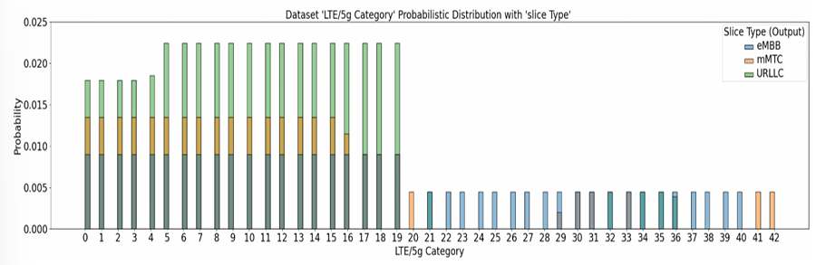
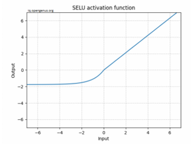
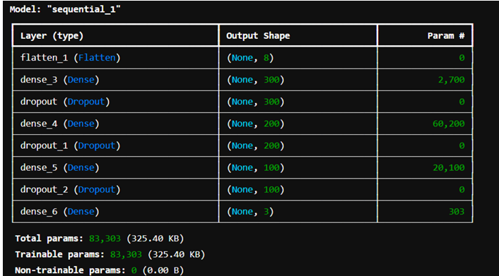
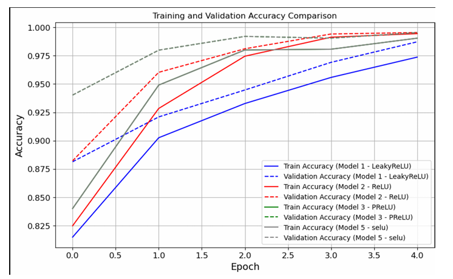

# Deep Learning-Based Network Slicing in 5G Networks

## Introduction

Network slicing in 5G refers to the capability of  dividing a single physical network infrastructure into multiple virtual networks, known as slices.Tailored to cater to distinct demands of various services, applications or user clusters, each network slice enables the establishment of personalized and distinct virtual networks that harmoniously operate on a common underlying
physical structure.

## Objectives

The primary objectives of this research are:

- **Resource Optimization**: Develop deep learning models to optimize resource allocation for network slices.
- **Dynamic Slice Management**: Utilize Deep Learning techniques to adaptively manage slices based on real-time traffic and service demands.
- **QoS Enhancement**: Predict congestion and latency issues to maintain QoS.
- **Scalability**: Enable seamless scaling of slices without introducing overhead or reliability issues.

## Architecture

The architecture of network slicing integrates both physical and virtual components:

1. **Physical Layer**: Comprises the base stations, servers, and routers.
2. **Virtualization Layer**: Abstracts physical resources into virtual instances using technologies like SDN and NFV.
3. **Slice Management and Orchestration Layer**: Handles the lifecycle of slices, including creation, scaling, and termination.

## Methodology

The methodology implemented in this project follows a structured framework, including:

1. **System Architecture and Components**: Leveraging the principles of SDN and NFV for efficient network slicing.
2. **Data Collection and Preprocessing**:
   
   - Preprocessing: Encoding categorical variables, handling missing values, and feature extraction using Cramer's V.
3. **Exploratory Data Analysis**:
   
   - Visualized, categorized and extracted Feature Importances using traditional ML techniques.
4. **Model Training and Evaluation**:
   - Deep learning models were trained using supervised learning methods.
   - Different DL architectures were analyzed, with in depth analysis and testing with different activation functions and their role in the complexity of the model
   - Performance was evaluated using metrics such as accuracy, precision, recall, and F1 score.

   

   

   

## Results

- **Performance Metrics**:
  - Improved throughput, reduced latency, and enhanced reliability.
  - Confusion Matrix and Classification Reports demonstrate the effectiveness of the proposed deep learning models.
- **Comparative Analysis**:
  - Deep learning-based approaches showed significant improvements over traditional methods.

## Implementation Details

1. **Data Preparation**:
   - Cleaned and encoded dataset for model compatibility.
2. **Feature Selection**:
   - Identified significant features using Random Forest and Cramer's V.
3. **Model Training**:
   - Employed supervised learning techniques for slice classification and optimization.
4. **Evaluation**:
   - Benchmarked against traditional methods to highlight the advantages of deep learning.

## Future Scope

- Making a 5G simmulation enviroment for model testing
- Model for automating the extracting process of KPIs from devices
- Exploring hybrid models that combine multiple machine learning techniques.
- Adapting the framework for 6G networks.
## Contact Information

For inquiries or further information, please contact 11a.rudroneelsengupta@gmail.com

LinkedIn-www.linkedin.com/in/rudrasengupta

